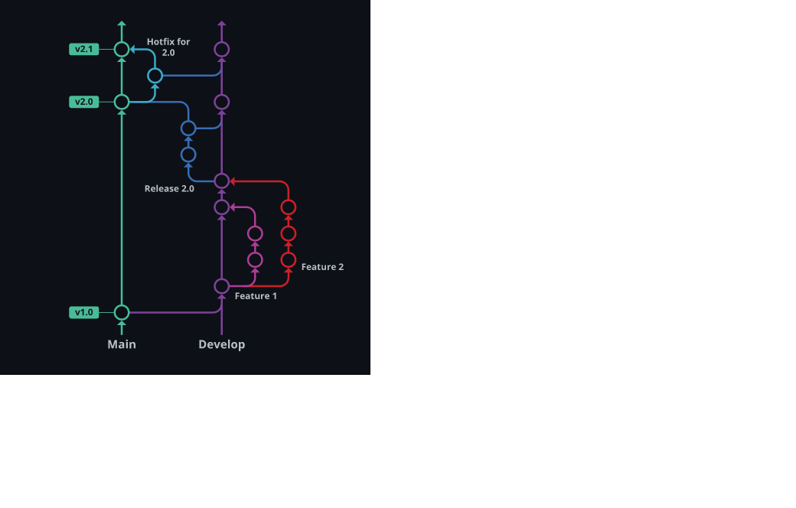

# Multibranch CI with Gitflow

## Gitflow  

  

## Docker
```
docker build -t dockerspd/node-demo-app .  
docker push dockerspd/node-demo-app  
docker run -d -p 3100:3000 -v C:\STHITA\CLIENT_WORKS\RMA\POC\Gitflow-demo\node-gitflow\node-demo-app:/root dockerspd/node-demo-app  

```
## Steps to trigger a Jenkins build  
```
git flow feature start vX.XX.XXX    []( git flow feature start v1.0.8 )  
git add .  
git commit -m "commit for vX.XX.XXX"  []( ex: git commit -m "comit for v1.0.8 )  
git tag -a vX.XX.XXX -m "tagging for vX.XX.XXX"  []( ex: git tag -a v1.0.8  -m "tagging for v1.0.8"  )  
git flow feature finish  vX.XX.XXX   []( ex: git flow feature finish  v1.0.8  )  
git push --tags  
git push  

```

## Gitflow References  

https://endjin.com/blog/2013/04/a-step-by-step-guide-to-using-gitflow-with-teamcity-part-3-gitflow-commands

https://www.gitkraken.com/learn/git/git-flow  


```  
git flow init  
git flow init -fd  


git flow feature [list] [-v]  
git flow feature start [-F] <name> [<base>]  
git flow feature finish [-rFkDS] [<name|nameprefix>]  
git flow feature publish <name>  
git flow feature track <name>  
git flow feature diff [<name|nameprefix>]  
git flow feature rebase [-i] [<name|nameprefix>]  
git flow feature checkout [<name|nameprefix>]  
git flow feature pull [-r] <remote> [<name>]  


git flow release start <version>  
git flow release finish <version>  
git flow release publish <name>  
git flow release track <name>  


git flow hotfix start <version>  
git flow hotfix finish <version>  
git flow hotfix publish <version>  
git flow hotfix track <version>  


```
